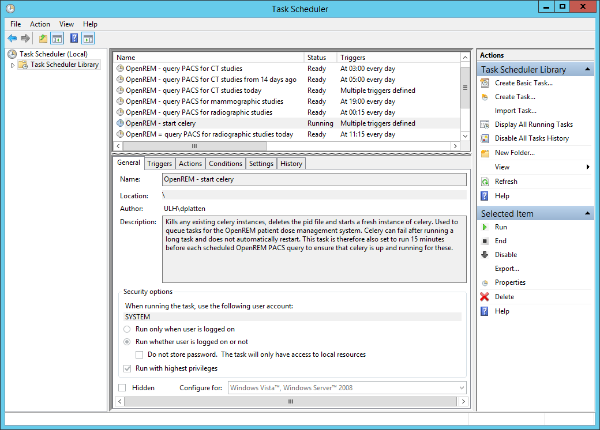
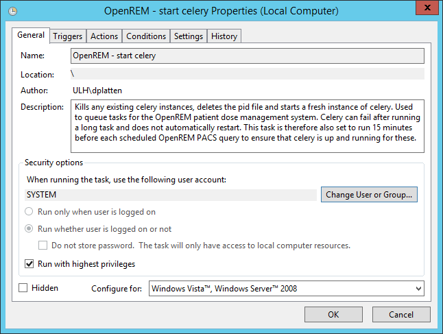
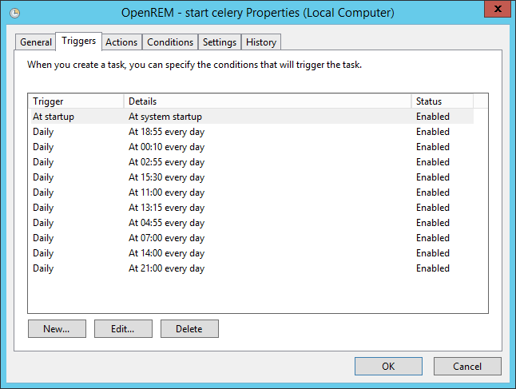
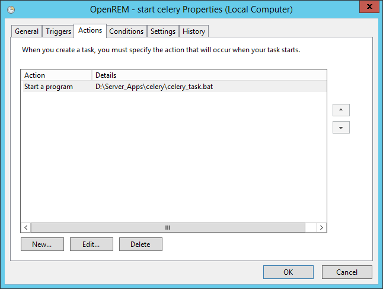
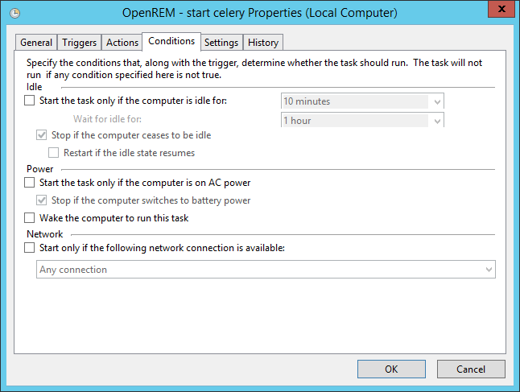
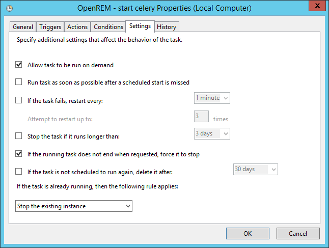

#################################################
Daemonising Celery and Flower on Windows - Legacy
#################################################

To ensure that the Celery task queue and Flower are started at system start-up
it is advisable to launch them using batch files and configure Windows Task
Scheduler to run each of these at system start-up.

Celery will sometimes fall over during the execution of a long task. If Celery
frequently falls over on your system then Windows Task Scheduler can be used to
restart Celery on a regular basis. The Task Scheduler can also be used to
ensure celery is running a few minutes prior to scheduled PACS queries.

An example batch file is shown below for running and restarting Celery. This
calls separate batch files to start Celery and Flower, also shown below.

Celery control batch file
=========================

`celery_task.bat`, to be run as a scheduled task.

.. sourcecode:: bat

    :: Create variables containing the name and path of the Celery pid file and the
    :: names and paths to the batch files used to run Celery and Flower.
    SET celeryPidFile=E:\media_root\celery\default.pid
    SET celeryStartFile=D:\Server_Apps\celery\celery_start.bat
    SET flowerStartFile=D:\Server_Apps\flower\flower_start.bat

    :: Celery 3.1.25 cannot be shutdown gracefully, and has to be killed. The
    :: following command will kill all celery.exe processes and any python.exe
    :: processes associated with Celery. The celery.exe process that is running
    :: Flower will also be killed by this command.
    TASKKILL /IM celery.exe /T /F

    :: Force the deletion of the Celery pid file so that Celery can be restarted.
    DEL /F "%celeryPidFile%"
        
    :: Start Flower again.
    START /B CMD /C CALL "%flowerStartFile%"

    :: Start Celery again.
    START /B CMD /C CALL "%celeryStartFile%"

Celery start batch file
=======================

`celery_start.bat`, called by `celery_task.bat`.

.. sourcecode:: bat

    :: Create variables containing the drive and path to OpenREM and the name and
    :: path of the Celery pid and log files.
    SET openremDrive=D:
    SET openremPath=D:\Server_Apps\python27\Lib\site-packages\openrem
    SET celeryPidFile=E:\media_root\celery\default.pid
    SET celeryLogFile=E:\media_root\celery\default.log

    :: Change to the drive on which OpenREM is installed and navigate to the
    :: OpenREM folder.
    %openremDrive%
    CD "%openremPath%"

    :: Start Celery.
    celery worker -n default -Ofair -A openremproject -c 4 -Q default --pidfile=%celeryPidFile% --logfile=%celeryLogFile%

Flower start batch file
=======================

`flower_start.bat`, called by `celery_task.bat` and also used to start Flower at system start-up.

.. sourcecode:: bat

    :: Create variables containing the drive and path to OpenREM and the name and
    :: path of the Flower log file and the Flower port.
    SET openremDrive=D:
    SET openremPath=D:\Server_Apps\python27\Lib\site-packages\openrem
    SET flowerLogFile=E:\media_root\celery\flower.log
    SET flowerPort=5555

    :: Change to the drive on which OpenREM is installed and navigate to the
    :: OpenREM folder.
    %openremDrive%
    CD "%openremPath%"

    :: Start Flower using Celery.
    celery -A openremproject flower --port="%flowerPort%" --loglevel=info --log-file-prefix="%flowerLogFile%"

Setting up a scheduled task
===========================

For Celery
++++++++++

Open ``Task Scheduler`` on the OpenREM server and then click on the ``Task Scheduler Library``
item in the left-hand pane. This should look something like figure 1 below, but without the
OpenREM tasks present.

   Figure 1: An overview of Windows Task Scheduler

To create a new task for celery click on ``Create Task...`` in the ``Actions`` menu in the
right-hand pane. Give the task a name and description. Next, click on the
``Change User or Group`` button and type ``system`` in to the box, then click
``Check Names``, then click ``OK``. This sets the server's ``SYSTEM`` user to run the
task. Also check the ``Run with highest prilileges`` box. Your task should now look similar
to figure 2.

   Figure 2: General properties

Next, click on the ``Triggers`` tab so that you can set when the task will be run. As a
minimum you should add an ``At startup`` trigger. To do this, click ``New...``. In the
dialogue box that appears select ``At startup`` from the ``Begin the task`` options and ensure
that the ``Enabled`` checkbox is selected. Then click ``OK``. You may wish to add other
triggers that take place at specific times during the day, as shown in figure 3.

In the example shown in figure 3 celery is started at system start up, and restarted multiple
times each day to ensure that it is running before any PACS queries. Your requirements may
be more straightforward than this example.

   Figure 3: Trigger properties

Now click on the ``Actions`` tab so that you can add the action that is taken when
the task is run. Click on ``New...``, and in the dialogue box that appears select
``Start a program`` as the ``Action``. Click on ``Browse`` and select the celery
batch file that you created earlier. Click ``OK`` to close the ``New Action``
dialogue box. Figure 4 shows an example of the the ``Actions`` tab.

   Figure 4: Action properties

There are no particular conditions set for the task, as shown in figure 5.

   Figure 5: Condition properties

Finally, click on the ``Settings`` tab (figure 6). Check the ``Allow task to be run on demand``
box, and also the ``If the running task does not end when requested, force it to stop`` box.
Choose ``Stop the existing instance`` from the ``If the task is already running, then the following rule applies:``
list. Then click the ``OK`` button to add the task to the scheduler library.

   Figure 6: Task settings

For Flower
++++++++++

Repeat the above steps for the Flower batch file, but only configure the Flower
task to trigger on system start-up: there should be no need to schedule
re-starts of Flower.
