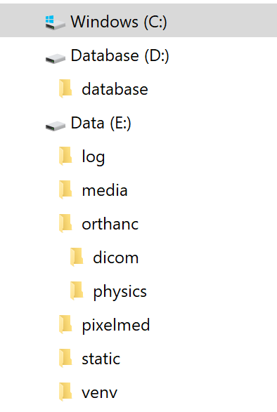
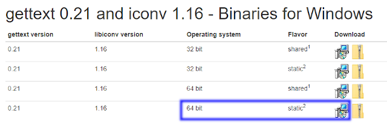
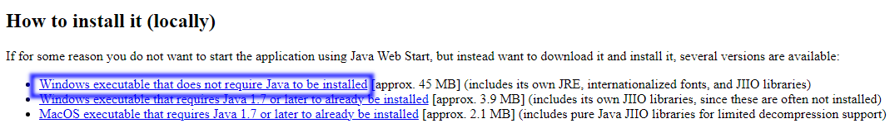
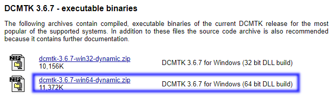
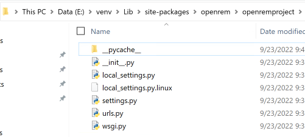
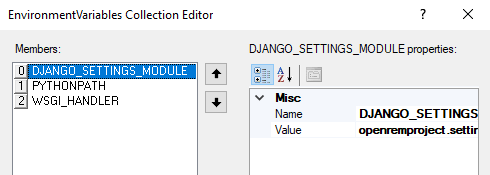
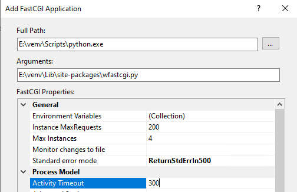
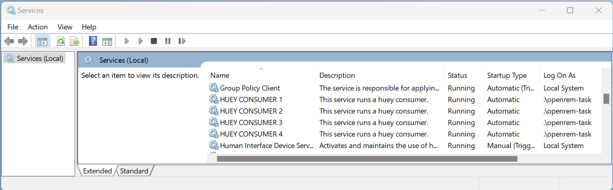

**********************
Native Windows install
**********************

**Document not ready for translation**

This install is based on Windows Server 2022 using:

* Python 3.10 running in a virtualenv
* Database: PostgreSQL
* DICOM Store SCP: Orthanc running on port 104
* Webserver: Microsoft IIS running on port 80
* WinSW to run background tasks as services
* Notepad++ for editing files
* Database files stored on D:
* OpenREM files stored on E:
* With Physics (QA) images being collected and zipped for retrieval

The instructions should work for Windows Server 2016 and 2019; and will probably work with Windows 10/11 with some
modification. Desktop editions of Windows are not recommended for a production OpenREM install.

If you are upgrading an existing installation to a new Windows server, go to the :doc:`upgrade_windows_new_server`
first.

If you are upgrading an existing Windows Server installation in-place, go to :doc:`upgrade_windows` instead.

If you are installing on a server with no internet access, go to :doc:`install_offline` to download the packages.

These instructions assume the following disk layout - there is more information about the reasoning in the box below:

* ``C:`` OS disk
* ``D:`` Database disk
* ``E:`` Data disk

Initial prep
============

Creating folders
^^^^^^^^^^^^^^^^

.. admonition:: Why D: and E: drives?

    OpenREM data are stored on drive E: to keep the data away from the operating system drive so that it is easier
    for building/recreating the server and knowing what needs to be backed up.

    For the same reason, we will install PostgreSQL so that the database data are store on drive D: - this makes it possible
    to provide a different configuration of disk for the database drive, with different backup policies.

    However, it is also possible to store all the data on the C: drive if that works better for your installation. In
    this case, it would be advisable to create a folder C:\\OpenREM\\ and create all the folders specified below into that
    folder.

    You can also use different drive letters if that works better for your installation. **In both cases paths will need
    to be modified in the instructions to suite**.

   Figure 1: Windows install folder layout

Create the following folders. The instructions here are for a ``CMD`` window but they can be created in Windows Explorer
instead:

.. code-block:: console

    C:\Users\openrem>D:
    D:\>mkdir database
    D:\>E:
    E:\>mkdir log media pixelmed dcmtk 7-zip static task_queue venv orthanc\dicom orthanc\physics orthanc\storage winsw

Set permissions
---------------

* Right click on the ``E:\log`` folder and click ``Properties``
* In the ``Security`` tab click ``Edit...`` and ``Add...``

.. admonition:: If the server is connected to a domain

    If the server is connected to a domain, the ``From this location:`` will have the name of the domain. Click
    ``Locations...`` and choose the name of the server instead of the domain name.

    .. figure:: img/PermissionsDomain.png
       :align: center
       :alt: Set account location
       :target: _images/PermissionsDomain.png

       Figure 2: Set account location

* Enter the object name ``IIS_IUSRS`` and click ``OK``
* Tick the ``Modify`` ``Allow`` to enable read and write permissions
* Click ``OK`` twice to close the dialogues

* Repeat for the ``E:\media`` and ``E:\task_queue`` folders

.. _windows_install_packages:

Installing packages
^^^^^^^^^^^^^^^^^^^

Python
------

Download the latest version for Windows from https://www.python.org/downloads/ as long as it is in the 3.10 series.
OpenREM v1.0 has not been tested with Python 3.11 yet.

Open the downloaded file to start the installation:

* Customize installation
* Leave all the Optional Features ticked, and click ``Next``
* Tick ``Install for all users`` - this will automatically tick ``Precompile standard library``
* ``Install``
* Click to ``Disable path length limit`` - might not be necessary but might be useful!
* ``Close``

Orthanc
-------

Download the 64 bit version from https://www.orthanc-server.com/download-windows.php.

The download file might be blocked because it isn't a commonly downloaded executable. Click the ``...`` menu
and select ``Keep``. Then click ``Show more`` and ``Keep anyway``.

Open the downloaded file to start the installation:

* Click ``Next >``, accept the agreement and ``Next >`` again.
* Default install location, ``Next >``
* Select Orthanc storage directory - ``Browse...`` to ``E:\orthanc\storage``, ``OK`` and ``Next >``
* Click ``Next >`` for a Full installation
* Start Menu Folder ``Next >``
* Ready to Install ``Install``
* ``Finish``

PostgreSQL
----------

Download the latest version of PostgreSQL from https://www.enterprisedb.com/downloads/postgres-postgresql-downloads -
choose the Windows x86-64 version. OpenREM v1.0 has been tested with PostgreSQL v14.5.

Open the downloaded file to start the installation:

* Some Microsoft redistributables will install
* Click ``Next >`` to start
* Default Installation Directory ``Next >``
* All components ``Next >``
* Data Directory - browse to ``D:\database`` then ``Select folder`` and ``Next >``
* Create a password for the ``postgres`` superuser - you will need this to setup the database with pgAdmin 4 later
* Enter it twice and ``Next >``
* Default port ``Next >``
* Default Locale ``Next >``
* Pre Installation Summary ``Next >``
* Ready to Install ``Next >`` and the installation will begin
* Untick ``Launch Stack Builder at exit``
* ``Finish``

gettext
-------

.. admonition:: What is gettext for?

    The gettext binary enables the translations to be available to users of the web interface. It is not
    essential if you don't want the translations to be available.

Download the 64 bit static version of gettext 0.21 from https://mlocati.github.io/articles/gettext-iconv-windows.html.
Use the ``.exe`` version (software install icon, not the zip icon)

   Figure 3: gettext download page

Open the downloaded file to start the installation:

* Accept the agreement ``Next >``
* Default installation directory ``Next >``
* Additional Tasks leave both boxes ticked ``Next >``
* Ready to Install ``Install``
* ``Finish``

Pixelmed
--------

Download DoseUtility from from the page
http://www.dclunie.com/pixelmed/software/webstart/DoseUtilityUsage.html - find ``How to install it (locally)`` near the
bottom of the page and click the ``Windows executable that does not require Java to be installed`` link.

   Figure 4: Pixelmed download page

* Open the downloaded zip file and open a new file browser at ``E:\pixelmed``
* Drag the contents of the zip file to the ``pixelmed`` folder

DCMTK
-----

Download from https://dcmtk.org/dcmtk.php.en - look for the ``DCMTK executable binaries`` section, and download the
64 bit DLL build for Windows.

   Figure 5: DCMTK download page

* Open the downloaded zip file and open a new file browser at ``E:\dcmtk``
* Drag the contents of the dcmtk-3.x.x-win64-dynamic folder in the zip file to the ``dcmtk`` folder
* You should end up with ``E:\dcmtk\bin\`` etc

7Zip
----

Download the 64-bit x64 exe file from https://www.7-zip.org/

* Type, or click on the ``...`` to browse to ``E:\7-zip\``
* ``Install``
* ``Close``

WinSW
-----

Download the 64-bit x64 exe file from https://github.com/winsw/winsw/releases/tag/v2.12.0

* Open a new file browser at ``E:\winsw``
* Drag the exe file to the ``winsw`` folder
* Rename the exe file from ``WinSW-x64`` to ``WinSW``

Notepad++
---------

Download the latest version of Notepad++ from https://notepad-plus-plus.org/downloads/

Open the downloaded file to start the installation:

* Select a language ``OK``
* Welcome ``Next >``
* License Agreement ``I Agree``
* Install Location ``Next >``
* Choose Components ``Next >``
* ``Install``
* ``Finish`` (you can untick the ``Run Notepad++`` option, we don't need it yet)

IIS
---

* Open the Control Panel
* Search for ``windows features``
* Select ``Turn Windows features on or off``
* Start the wizard ``Next >``
* Role-based or feature-based installation ``Next >``
* Leave the current server highlighted ``Next >``
* Check the ``Web Server (IIS)`` box
* In the pop-up dialogue for adding IIS Management Console, click ``Add Features``
* ``Next >``
* Features, ``Next >``
* Web Server Role (IIS) ``Next >``
* Expand the ``Application Development`` section
* Check the ``CGI`` box, ``Next >``
* ``Install``
* ``Close``

.. admonition:: Running OpenREM on Windows 10 or Windows 11?

    For non-server environments follow these IIS instructions:

    * Open the Control Panel
    * Search for ``windows features``
    * Select ``Turn Windows features on or off``
    * Check the ``Internet Information Services`` box (figure 6)
    * Expand the ``Internet Information Services`` - ``World Wide Web Services`` - ``Application Development Features`` sub-menu (figure 7)
    * Check the ``CGI`` box (figure 7)
    * Click ``OK``

    .. figure:: img/windows11-iis-on.png
       :figwidth: 40%
       :align: center
       :alt: Enabling IIS on Windows 11
       :target: _images/windows11-iis-on.png

       Figure 6: Enabling IIS on Windows 11

    .. figure:: img/windows11-iis-on-inc-cgi.png
       :figwidth: 40%
       :align: center
       :alt: Enabling CGI within the IIS settings on Windows 11
       :target: _images/windows11-iis-on-inc-cgi.png

       Figure 7: Enabling CGI within the IIS settings on Windows 11

You can check the server is running by browsing to http://localhost/ on the server. You should see the
default IIS Welcome page. It might not work immediately, check again in a few minutes.

Installing Python packages
^^^^^^^^^^^^^^^^^^^^^^^^^^

Create and activate the virtualenv
----------------------------------

Open a ``CMD`` window:

.. code-block:: console

    C:\Users\openrem>e:
    E:\>py -m venv venv
    E:\>venv\Scripts\activate
    (venv) E:\>

Install OpenREM
---------------
.. admonition:: Installing on a server with no internet access

    Make sure the virtualenv is activated (command line will have the name of the virtualenv as a prefix:
    ``(venv) E:\``), then navigate to where the ``openremfiles`` directory is that you copied from the computer *with*
    internet access, eg if it is in your desktop folder:

    .. code-block:: console

        (venv) E:\>c:
        (venv) C:\>cd Users\openrem\Desktop

    Now upgrade ``pip`` and install OpenREM and its dependencies:

    .. code-block:: console

        (venv) C:\Users\openrem\Desktop>pip install --no-index --find-links=openremfiles --upgrade pip
        (venv) C:\Users\openrem\Desktop>pip install --no-index --find-links=openremfiles openrem

.. code-block:: console

    (venv) E:\>pip install --upgrade pip
    (venv) E:\>pip install openrem==1.0.0b1
    (venv) E:\>pip install wfastcgi

OpenREM configuration and database creation
===========================================

PostgreSQL database creation
^^^^^^^^^^^^^^^^^^^^^^^^^^^^

Start  pgAdmin 4 - you will need the password you set when installing PostgreSQL

Create user
-----------

* Click on ``Servers`` to expand, enter the password again
* Right click ``Login/Group Roles``, ``Create``, ``Login/Group Role...``
* Name: ``openremuser``
* Definition, Password: add a password for the openremuser
* Privileges: activate ``Can login?`` and ``Create database?``
* ``Save``

Create database
---------------

* Right click ``Databases``, ``Create``, ``Database...``
* Database: ``openremdb``
* Owner: ``openremuser``
* ``Save``

.. _updatewindowsconfig:

Configure OpenREM
^^^^^^^^^^^^^^^^^

Open the ``E:\venv\Lib\site-packages\openrem\openremproject`` folder and rename the example ``local_settings.py`` and
``wsgi.py`` files to remove the ``.windows`` and ``.example`` suffixes. Removing the file name extension will produce a
warning to check if you are sure - ``Yes``:

   Figure 8: openremproject folder

Edit ``local_settings.py`` as needed (right click ``Edit with Notepad++``) Make sure you change the ``PASSWORD``, the
``SECRET_KEY`` (to anything, just change it), the ``ALLOWED_HOSTS`` list, regionalisation settings and the ``EMAIL``
configuration. You can modify the email settings later if necessary. Some settings are not shown here but are documented
in the settings file or elsewhere in the docs. For details on the final variable see :ref:`ignore-device-obs-uid`.

.. admonition:: Upgrading to a new server

    If you are upgrading to a new Linux server, review the ``local_settings.py`` file from the old server to copy over
    the ``ALLOWED_HOSTS`` list and the ``EMAIL`` configuration, and check all the other settings. Change the
    ``SECRET_KEY`` from the default, but it doesn't have to match the one on the old server. The database ``NAME``,
    ``USER`` and ``PASSWORD`` will be the ones you created on the new server. For details on the final variable see
    :ref:`ignore-device-obs-uid`.

.. code-block:: python
    :emphasize-lines: 4-6, 19-20,28-31,43,48,51,62-69,71

    DATABASES = {
        'default': {
            'ENGINE': 'django.db.backends.postgresql',  # Add 'postgresql', 'mysql', 'sqlite3' or 'oracle'.
            'NAME': 'openremdb',                     # Or path to database file if using sqlite3.
            'USER': 'openremuser',                   # Not used with sqlite3.
            'PASSWORD': '',                          # Not used with sqlite3.
            'HOST': '',                              # Set to empty string for localhost. Not used with sqlite3.
            'PORT': '',                              # Set to empty string for default. Not used with sqlite3.
        }
    }

    TASK_QUEUE_ROOT = 'E:/task_queue/'

    MEDIA_ROOT = 'E:/media/'

    STATIC_ROOT = 'E:/static/'
    JS_REVERSE_OUTPUT_PATH = os.path.join(STATIC_ROOT, 'js', 'django_reverse')

    # Change secret key
    SECRET_KEY = 'hmj#)-$smzqk*=wuz9^a46rex30^$_j$rghp+1#y&amp;i+pys5b@$'

    # DEBUG mode: leave the hash in place for now, but remove it and the space (so DEBUG
    # is at the start of the line) as soon as something doesn't work. Put it back
    # when you get it working again.
    # DEBUG = True

    ALLOWED_HOSTS = [
        # Add the names and IP address of your host, for example:
        'openrem-server',
        'openrem-server.ad.abc.nhs.uk',
        '10.123.213.22',
    ]

    LOG_ROOT = 'E:/log/'
    LOG_FILENAME = os.path.join(LOG_ROOT, 'openrem.log')
    QR_FILENAME = os.path.join(LOG_ROOT, 'openrem_qr.log')
    EXTRACTOR_FILENAME = os.path.join(LOG_ROOT, 'openrem_extractor.log')

    # Regionalisation settings
    #   Date format for exporting data to Excel xlsx files.
    #   Default in OpenREM is dd/mm/yyyy. Override it by uncommenting and customising below; a full list of codes is
    #   available at https://msdn.microsoft.com/en-us/library/ee634398.aspx.
    # XLSX_DATE = 'mm/dd/yyyy'
    #   Local time zone for this installation. Choices can be found here:
    #   http://en.wikipedia.org/wiki/List_of_tz_zones_by_name
    #   although not all choices may be available on all operating systems.
    #   In a Windows environment this must be set to your system time zone.
    TIME_ZONE = 'Europe/London'
    #   Language code for this installation. All choices can be found here:
    #   http://www.i18nguy.com/unicode/language-identifiers.html
    LANGUAGE_CODE = 'en-us'

    DCMTK_PATH = 'E:/dcmtk/bin'
    DCMCONV = os.path.join(DCMTK_PATH, 'dcmconv.exe')
    DCMMKDIR = os.path.join(DCMTK_PATH, 'dcmmkdir.exe')
    JAVA_EXE = 'E:/pixelmed/windows/jre/bin/java.exe'
    JAVA_OPTIONS = '-Xms256m -Xmx512m -Xss1m -cp'
    PIXELMED_JAR = 'E:/pixelmed/pixelmed.jar'
    PIXELMED_JAR_OPTIONS = '-Djava.awt.headless=true com.pixelmed.doseocr.OCR -'

    # E-mail server settings - see https://docs.djangoproject.com/en/2.2/topics/email/
    EMAIL_HOST = 'localhost'
    EMAIL_PORT = 25
    EMAIL_HOST_USER = ''
    EMAIL_HOST_PASSWORD = ''
    EMAIL_USE_TLS = 0         # Use 0 for False, 1 for True
    EMAIL_USE_SSL = 0         # Use 0 for False, 1 for True
    EMAIL_DOSE_ALERT_SENDER = 'your.alert@email.address'
    EMAIL_OPENREM_URL = 'http://your.openrem.server'

    IGNORE_DEVICE_OBSERVER_UID_FOR_THESE_MODELS = ['GE OEC Fluorostar']

Populate OpenREM database and collate static files
^^^^^^^^^^^^^^^^^^^^^^^^^^^^^^^^^^^^^^^^^^^^^^^^^^

In a ``CMD`` window, move to the openrem Python folder and activate the virtualenv:

.. code-block:: console

    C:\Users\openrem>e:
    E:\>cd venv\Lib\site-packages\openrem
    E:\venv\Lib\site-packages\openrem>e:\venv\Scripts\activate
    (venv) E:\venv\Lib\site-packages\openrem>

.. admonition:: Upgrading to a new server

    If you are upgrading to a new Windows server, do these additional steps before continuing with those below:

    * Rename ``E:\venv\Lib\site-packages\openrem\remapp\migrations\0001_initial.py.1-0-upgrade`` to ``0001_initial.py``

    Import the database - update the path to the database backup file you copied from the old server. These steps
    can take a long time depending on the size of the database and the resources of the server:

    .. code-block::

        C:\Users\openrem>"c:\Program Files\PostgreSQL\14\bin\pg_restore.exe" --no-privileges --no-owner -U openremuser -d openremdb -W windump.bak

    Migrate the database:

    .. code-block:: console

        (venv) E:\venv\Lib\site-packages\openrem>python manage.py migrate --fake-initial

    .. code-block:: console

        (venv) E:\venv\Lib\site-packages\openrem>python manage.py migrate remapp --fake

.. code-block:: console

    (venv) E:\venv\Lib\site-packages\openrem>python manage.py makemigrations remapp

.. warning::

    Make sure you didn't get a ``RuntimeWarning`` when running the last command - scroll back up to the command and
    check you *don't* see the following:

    .. code-block:: console

        (venv) E:\venv\Lib\site-packages\openrem>python manage.py makemigrations remapp
        E:\venv\lib\site-packages\django\core\management\commands\makemigrations.py:105: RuntimeWarning:

        Got an error checking a consistent migration history performed for database connection 'default': unable to
        open database file

    If you do, check the database name and password settings in the ``local_settings.py`` file. You will need to delete
    the file ``E:\venv\Lib\site-packages\openrem\remapp\migrations\0001_initial.py`` before trying again.

.. code-block:: console

    (venv) E:\venv\Lib\site-packages\openrem>python manage.py migrate
    (venv) E:\venv\Lib\site-packages\openrem>python manage.py loaddata openskin_safelist.json
    (venv) E:\venv\Lib\site-packages\openrem>python manage.py collectstatic --no-input --clear

Create the translation files, assuming ``gettext`` was installed:

.. code-block:: console

    (venv) E:\venv\Lib\site-packages\openrem>python manage.py compilemessages

If this is a new install, not an upgrade, create the superuser account:

.. code-block:: console

    (venv) E:\venv\Lib\site-packages\openrem>python manage.py createsuperuser

Webserver
=========

Configure IIS
^^^^^^^^^^^^^

* Open ``Internet Information Services (IIS) Manager`` from the Start menu or the Administrative Tools.
* Click on the name of your server in the ``Connections`` pane on the left
* Double click on ``FastCGI Settings``
* In the ``Actions`` pane on the right, click ``Add Application``
* In the ``Full Path:`` box type or browse to ``E:\venv\Scripts\python.exe``
* In the ``Arguments`` box type the path to wfastcgi.py: ``E:\venv\Lib\site-packages\wfastcgi.py``
* Under FastCGI properties, click on ``(Collection)`` next to ``Environment Variables`` and click on the grey ``…`` box
* In the EnvironmentVariables Collection Editor click ``Add``
* Change the value of ``Name`` to ``DJANGO_SETTINGS_MODULE`` (must be upper-case)
* Set the ``Value`` to ``openremproject.settings``
* Click ``Add`` again and add the variable name ``PYTHONPATH`` with the value ``E:\venv\Lib\site-packages\openrem``
* Click ``Add`` again and add the variable name ``WSGI_HANDLER`` with the value ``django.core.wsgi.get_wsgi_application()``
* Click ``OK``

   Figure 9: Environment Variables Collection Editor

* Under FastCGI Properties -> Process Model click on the ``Activity Timeout`` value and change it to ``1200``

.. admonition:: Activity Timeout on slow running systems

    If you encounter issues with long-running requests failing on slow running systems, you might try increasing the
    value of the ``Activity Timeout`` further.

   Figure 10: Add FastCGI Application settings

* Click ``OK`` to close the dialogue box

Create a new website
^^^^^^^^^^^^^^^^^^^^

* In the ``Connections`` pane expand the tree under server name
* Expand the Sites folder, right click on ``Default Website`` and click ``Remove``
* Click ``Yes``
* Right click on ``Sites`` and click ``Add Website…``
* Enter Site name as ``OpenREM``
* Under Content Directory Physical path enter or browse to ``E:\venv\Lib\site-packages\openrem``
* Click ``OK``

Configure the new website
^^^^^^^^^^^^^^^^^^^^^^^^^

* Click on the ``OpenREM`` site under ``Connections`` in the left pane
* Double click on ``Handler Mappings``
* In the right pane, under ``Actions`` click ``Add Module Mapping…``
* In the ``Request Path`` box enter an asterix (``*``)
* In the Module box select ``FastCgiModule`` (*not the CgiModule*)
* In the ``Executable`` box enter ``E:\venv\Scripts\python.exe|E:\venv\Lib\site-packages\wfastcgi.py``
* In ``Name`` type ``OpenREM CGI handler`` (value of name is not important)
* Click ``Request Restrictions`` and untick the ``Invoke handler only if request is mapped to:`` checkbox
* Click ``OK`` twice to close the Request Restrictions dialog and the Add Module Mapping dialogue
* When prompted ``Do you want to create a FastCGI application for this executable?`` click ``No``

.. admonition:: Quick test!

    You can now browse on the server to http://localhost/ and you should see an "ugly" version of the website. It will
    look better after we have configured the static files, next!

Configure IIS to server the static files
^^^^^^^^^^^^^^^^^^^^^^^^^^^^^^^^^^^^^^^^

* Right click on the ``OpenREM`` site under ``Connections`` in the left pane
* Click ``Add Virtual Directory``
* Enter ``static`` as the Alias
* Enter or browse to ``E:\static`` as the Physical path
* Click ``OK``

* Double click on ``Handler Mappings`` in the middle pane
* Click on ``View Ordered List...`` in the right pane
* Select ``StaticFile``
* Click ``Move Up`` in the ``Action`` pane on the right until ``StaticFile`` is at the top
* There will be a warning about the list order being changed - click ``Yes`` to continue

Test the webserver
^^^^^^^^^^^^^^^^^^

Browse to http://localhost/ on the server, or browse to the servername in a browser on another machine, and you should
be able to see the new OpenREM web service.

Task queue
==========

.. admonition:: Running OpenREM on Windows 10 or Windows 11?

    For non-server environments, where task executors don't need to be persistent across system restarts,
    there is a shortcut for starting workers. You can start a single worker in a new console as follows:
    
    .. code-block:: console

        C:\Users\openrem>E:
        E:\>cd venv\Lib\site-packages\openrem
        E:\venv\Lib\site-packages\openrem>e:\venv\Scripts\activate
        (venv) E:\venv\Lib\site-packages\openrem>python manage.py run_huey

    If you want more than one worker to run tasks in parallel,
    you will need to repeat the previous steps for each additional worker in a new console.

    You can stop a worker by pressing ``Ctrl`` + ``C`` in the appropriate console

    If you cannot start a worker or you are getting error messages, please make sure that your current user
    has read and write permissions in the ``E:\task_queue`` directory.

OpenREM uses a task queue to run its background tasks.
Therefore, we need additional Windows services that allow us to run these tasks separately from the web application.

To accomplish that we need to do the following:

Create local service account
^^^^^^^^^^^^^^^^^^^^^^^^^^^^

First we need to create an account that will allow the IIS worker to control the task workers. Most importantly, to kill a task if necessary.

There is a difference if you are connected to an Active Directory or not. Whatever suits your setup, follow the guide
``A`` if you are not in an Active Directory or ``B`` if you are.

Guide A
-------

For a Windows instance which is not associated to an Active Directory, it suffices to create a local user account:

* Open the ``Search Tab``
* Search for ``Add, edit, or remove other users``
* In the menu, click ``Add someone else to this PC``
* In the left pane right click on ``Users``
* Click ``New User...``
* Fill in all fields with the data of a new user account (see image)
* Untick ``User must change password at next login``
* Click ``Create``
* In the left pane click on ``Groups``
* Right click on ``IIS_IUSRS``
* Click ``Add to Group...``
* Click on the ``Add`` button
* In the textfield, enter the username of the previously created account
* Click ``Ok`` twice

Guide B
-------

For a Windows instance that is connected to an Active Directory, or even a controller of one, follow this guide:

* Open the ``Server Manager``
* In the navigation bar, click on ``Tools``
* Click ``Active Directory Users and Computers``
* In the left pane, expand your domain
* Right click on ``Users``
* Hove over ``New``
* Click on ``User``
* Fill in all required fields with the data of a new user account
* Click ``Next``
* Enter the new user password twice and untick ``User must change password at next login``
* Click ``Next`` and then ``Finish`` to create the service account

Creating worker services
^^^^^^^^^^^^^^^^^^^^^^^^

Copy the file from

* ``E:\venv\Lib\site-packages\openrem\sample-config\queue-init.bat`` to
* ``E:\winsw\``

Make sure that the previously downloaded and renamed ``WinSW.exe`` file is in the same folder (``E:\winsw\``).

* Double click the ``queue-init.bat`` file
* Enter your Domain name or leave empty if not applicable
* Enter the username of the previously created account
* Enter the associated password
* Enter the number of workers you would like to spawn, this number should no exceed the number of CPU cores available to your system
* Wait for the services to get registered and started up (Notice: many windows may appear and disappear quickly)

You should now be able to see the new workers in the list of Windows Services. Search for ``services`` on the Windows
Start menu and you will be shown a list of installed services. The OpenREM task workers are shown as
``HUEY CONSUMER n``, where ``n`` is the worker number, as shown in figure 11.

   Figure 11: Four Huey task workers in the Services window

Adjusting IIS Application Pool Identity
^^^^^^^^^^^^^^^^^^^^^^^^^^^^^^^^^^^^^^^
* Open ``Internet Information Services (IIS) Manager`` from the Start menu or the Administrative Tools.
* In the ``Connections`` pane expand the tree under server name
* Click on ``Application Pools``
* Right click on ``OpenREM`` in the middle pane
* Click ``Advanced Settings...``
* Under ``Process Model`` click on ``Identity`` and then on the grey ``…`` box
* Select the ``Custom account:`` radio button
* Click on ``Set...``
* Enter the credentials of the preivously created account. If you are in an Active Directory prefix ther usernmae with ``<YOUR-DOMAIN>\``
* Click ``OK`` three times

DICOM Store SCP
===============

Copy the Lua file to the Orthanc folder. This will control how we process the incoming DICOM objects.

Copy the file from

* ``E:\venv\Lib\site-packages\openrem\sample-config\openrem_orthanc_config_windows.lua`` to
* ``E:\orthanc\``

Edit the Orthanc Lua configuration options - right click on the file you just copied ``Edit with Notepad++``

Set ``use_physics_filtering`` to true if you want Orthanc to keep physics test studies, and have it put them in the
``E:\orthanc\dicom\`` folder. Set it to ``false`` to disable this feature. Add names or IDs to
``physics_to_keep`` as a comma separated list.

.. code-block:: lua
    :emphasize-lines: 3,7

    -- Set this to true if you want Orthanc to keep physics test studies, and have it
    -- put them in the physics_to_keep_folder. Set it to false to disable this feature
    local use_physics_filtering = true

    -- A list to check against patient name and ID to see if the images should be kept.
    -- Orthanc will put anything that matches this in the physics_to_keep_folder.
    local physics_to_keep = {'physics'}

Lists of things to ignore. Orthanc will ignore anything matching the content of these comma separated lists; they will
not be imported into OpenREM.

.. code-block:: lua
    :emphasize-lines: 3-7

    -- Lists of things to ignore. Orthanc will ignore anything matching the content of
    -- these lists: they will not be imported into OpenREM.
    local manufacturers_to_ignore = {'Faxitron X-Ray LLC', 'Gendex-KaVo'}
    local model_names_to_ignore = {'CR 85', 'CR 75', 'CR 35', 'CR 25', 'ADC_5146', 'CR975'}
    local station_names_to_ignore = {'CR85 Main', 'CR75 Main'}
    local software_versions_to_ignore = {'VixWin Platinum v3.3'}
    local device_serial_numbers_to_ignore = {'SCB1312016'}

Enable or disable additional functionality to extract dose information from older Toshiba and GE scanners, and specify
which CT scanners should use this method. Each system should be listed as ``{'Manufacturer', 'Model name'}``, with
systems in a comma separated list within curly brackets, as per the example below:

.. code-block:: lua
    :emphasize-lines: 3,7-10

    -- Set this to true if you want to use the OpenREM Toshiba CT extractor. Set it to
    -- false to disable this feature.
    local use_toshiba_ct_extractor = true

    -- A list of CT make and model pairs that are known to have worked with the Toshiba CT extractor.
    -- You can add to this list, but you will need to verify that the dose data created matches what you expect.
    local toshiba_extractor_systems = {
            {'Toshiba', 'Aquilion'},
            {'GE Medical Systems', 'Discovery STE'},
    }

Save any changes.

Edit the Orthanc configuration. Navigate to ``C:\Program Files\Orthanc Server\Configuration`` and right click on
``orthanc.json`` and click ``Edit with Notepad++``:

Add the Lua script to the Orthanc config:

.. code-block:: json-object
    :emphasize-lines: 4

    // List of paths to the custom Lua scripts that are to be loaded
    // into this instance of Orthanc
    "LuaScripts" : [
    "E:\\orthanc\\openrem_orthanc_config_windows.lua"
    ],

Set the AE Title and port:

.. code-block:: json-object
    :emphasize-lines: 2,5

    // The DICOM Application Entity Title
    "DicomAet" : "OPENREM",

    // The DICOM port
    "DicomPort" : 104,

.. note::

    Optionally, you may also like to enable the HTTP server interface for Orthanc (although if the Lua script is removing
    all the objects as soon as they are processed, you won't see much!):

    .. code-block:: json-object

        // Whether remote hosts can connect to the HTTP server
        "RemoteAccessAllowed" : true,

        // Whether or not the password protection is enabled
        "AuthenticationEnabled" : false,

    You will also need to open the firewall for port 8042.

    To see the Orthanc web interface, go to http://openremserver:8042/ -- of course change the server name to that of your
    server!

Save any changes.

Allow DICOM traffic through the firewall
^^^^^^^^^^^^^^^^^^^^^^^^^^^^^^^^^^^^^^^^

* Type ``windows firewall`` in the Start menu to open ``Windows Defender Firewall``
* Click ``Advanced settings`` in the left hand pane to open ``Windows Defender Firewall with Advanced Security``
* Click ``Inbound Rules`` in the left hand pane
* Click ``New Rule...`` in the right hand pane
* Click ``Port`` and ``Next >``
* Leave as ``TCP`` and specify port ``104`` and click ``Next >``
* ``Allow the connection``, ``Next >``
* Leave the boxes ticked for ``When does this rule apply`` if that is appropriate, ``Next >``
* Name ``Orthanc DICOM port``
* ``Finish``

Finish off
^^^^^^^^^^

Restart Orthanc:

* Launch ``Services`` from the start menu
* Find ``Orthanc`` on the list and click ``Restart``
* Orthanc logs can be reviewed at ``C:\Program Files\Orthanc Server\Logs`` - the current log file will have the latest
  date and time in the filename - right click ``Edit with Notepad++``

You can check if the port is running and allowed through the firewall using the ``Network`` tab of Resource Monitor.
