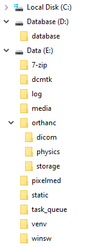

**********************
Native Windows install
**********************

**Document not ready for translation**

This install is based on Windows Server 2022 using:

* Python 3.10 running in a virtualenv
* Database: PostgreSQL
* DICOM Store SCP: Orthanc running on port 104
* Webserver: Microsoft IIS
* Notepad++ for editing files
* Database files stored on D:
* OpenREM files stored on E:
* With Physics (QA) images being collected and zipped for retrieval

The instructions should work for Windows Server 2016 and 2019; and will probably work with Windows 10/11 with some
modification. Desktop editions of Windows are not recommended for a production OpenREM install.

If you are upgrading an existing installation to a new Windows server, go to the :doc:`upgrade_windows_new_server`
first.

If you are upgrading an existing Windows Server installation in-place, go to :doc:`upgrade_windows` instead.

Initial prep
============

Creating folders
^^^^^^^^^^^^^^^^

   Figure 1: Windows install folder layout

Create the following folders. The instructions here are for a ``CMD`` window but they can be created in Windows Explorer
instead:

.. code-block:: console

    C:\Users\openrem>D:
    D:\>mkdir database
    D:\>E:
    E:\>mkdir log media pixelmed dcmtk static venv orthanc\dicom orthanc\physics orthanc\storage

.. admonition:: Why D: and E: drives?

    These folders are created on drive E: to keep the data away from the operating system drive so that it is easier
    for building/recreating the server and knowing what needs to be backed up.

    For the same reason, we will install PostgreSQL so that the database data is store on drive D: - this makes it possible
    to provide a different configuration of disk for the database drive, with different backup policies.

    However, it is also possible to store all the data on the C: drive if that works better for your installation. In
    this case, it would be advisable to create a folder C:\OpenREM\ and create all the folders specified below into that
    folder.

    You can also use different drive letters if that works better for your installation. In both cases paths will need
    to be modified in the instructions to suite.

Installing packages
^^^^^^^^^^^^^^^^^^^

Python
------

Download the latest version for Windows from https://www.python.org/downloads/ as long as it is in the 3.10 series.
OpenREM v1.0 has not been tested with Python 3.11 yet.

Open the downloaded file to start the installation:

* Customize installation
* Leave all the Optional Features ticked, and click ``Next``
* Tick ``Install for all users`` - this will automatically tick ``Precompile standard library``
* ``Install``
* Click to ``Disable path length limit`` - might not be necessary but might be useful!
* ``Close``

Orthanc
-------

Download the 64 bit version from https://www.orthanc-server.com/download-windows.php.

The download file might be blocked because it isn't a commonly downloaded executable. Click the ``...`` menu
and select ``Keep``. Then click ``Show more`` and ``Keep anyway``.

Open the downloaded file to start the installation:

* Click ``Next >``, accept the agreement and ``Next >`` again.
* Default install location, ``Next >``
* Select Orthanc storage directory - ``Browse...`` to ``E:\orthanc\storage``, ``OK`` and ``Next >``
* Click ``Next >`` for a Full installation
* Start Menu Folder ``Next >``
* Ready to Install ``Install``
* ``Finish``

PostgreSQL
----------

Download the latest version of PostgreSQL from https://www.enterprisedb.com/downloads/postgres-postgresql-downloads -
choose the Windows x86-64 version. OpenREM v1.0 has been tested with PostgreSQL v14.5.

Open the downloaded file to start the installation:

* Some Microsoft redistributables will install
* Click ``Next >`` to start
* Default Installation Directory ``Next >``
* All components ``Next >``
* Data Directory - browse to ``D:\database`` then ``Select folder`` and ``Next >``
* Create a password for the ``postgres`` superuser - you will need this to setup the database with pgAdmin 4 later
* Enter it twice and ``Next >``
* Default port ``Next >``
* Default Locale ``Next >``
* Pre Installation Summary ``Next >``
* Ready to Install ``Next >`` and the installation will begin
* Untick ``Launch Stack Builder at exit``
* ``Finish``

gettext
-------

Download the 64 bit static version of gettext 0.21 from https://mlocati.github.io/articles/gettext-iconv-windows.html.
Use the ``.exe`` version (software install icon, not the zip icon)

Open the downloaded file to start the installation:

* Accept the agreement ``Next >``
* Default installation directory ``Next >``
* Additional Tasks leave both boxes ticked ``Next >``
* Ready to Install ``Install``
* ``Finish``

Pixelmed and Java
-----------------

Download DoseUtility from http://www.dclunie.com/pixelmed/software/winexe/DoseUtilityWithOwnJRE.zip (from the page
http://www.dclunie.com/pixelmed/software/webstart/DoseUtilityUsage.html

* Open the downloaded zip file and open a new file browser at ``E:\pixelmed``
* Drag the contents of the zip file to the ``pixelmed`` folder

dcmtk
-----

Download the 64 bit executable binary zip file from https://dcmtk.org/dcmtk.php.en

* Open the downloaded zip file and open a new file browser at ``E:\dcmtk``
* Drag the contents of the dcmtk-3.x.x-win64-dynamic folder in the zip file to the ``dcmtk`` folder
* You should end up with ``E:\dcmtk\bin\`` etc

IIS
---

* Open the Control Panel
* Search for ``windows features``
* Select ``Turn Windows features on or off``
* Start the wizard ``Next >``
* Role-based or feature-based installation ``Next >``
* Leave the current server highlighted ``Next >``
* Check the ``Web Server (IIS)`` box
* In the pop-up dialogue for adding IIS Management Console, click ``Add Features``
* ``Next >``
* Features, ``Next >``
* Web Server Role (IIS) ``Next >``
* Expand the ``Application Development`` section
* Check the ``CGI`` box, ``Next >``
* ``Install``
* ``Close``

You can check the server is running by browsing to http://localhost/ on the server. You should see the
default IIS Welcome page.

Notepad++
---------

Download the latest version of Notepad++ from https://notepad-plus-plus.org/downloads/

Open the downloaded file to start the installation:

* Select a language ``OK``
* Welcome ``Next >``
* License Agreement ``I Agree``
* Install Location ``Next >``
* Choose Components ``Next >``
* ``Install``
* ``Finish`` (you can untick the ``Run Notepad++`` option, we don't need it yet)

Installing Python packages
^^^^^^^^^^^^^^^^^^^^^^^^^^

Create the virtualenv
---------------------

Open a ``CMD`` window:

.. code-block:: console

    C:\Users\openrem>e:
    E:\>py -m venv venv

Install OpenREM
---------------

.. code-block:: console

    E:\>venv\Scripts\activate
    (venv) E:\>pip install --upgrade pip
    (venv) E:\>pip install openrem
    (venv) E:\>pip install wfastcgi

OpenREM configuration and database creation
===========================================

PostgreSQL database creation
^^^^^^^^^^^^^^^^^^^^^^^^^^^^

* Start  pgAdmin 4 - you will need the password you set when installing PostgreSQL
* Click on ``Servers (1)`` to expand, enter the password again
* Right click ``Login/Group Roles``, ``Create``, ``Login/Group Role...``
* Name: ``openremuser``
* Definition, Password: add a password for the openremuser
* Privileges: activate ``Can login?`` and ``Create database?``
* ``Save``

* Right click ``Databases``, ``Create``, ``Database...``
* Database: ``openremdb``
* Owner: ``openremuser``
* ``Save``

Configure OpenREM
^^^^^^^^^^^^^^^^^

Open the ``E:\venv\Lib\site-packages\openrem\openremproject`` folder and rename the example ``local_settings.py`` and
``wsgi.py`` files to remove the ``.windows`` and ``.example`` suffixes. Removing the file name extension will produce a
warning to check if you are sure - ``Yes``:

.. figure:: img/openremproject_folder.png
   :figwidth: 60%
   :align: center
   :alt: openremproject folder
   :target: _images/openremproject_folder.png

   Figure 2: openremproject folder

Edit ``local_settings.py`` as needed (right click ``Edit with Notepad++``) Make sure you change the ``PASSWORD``, the
``SECRET_KEY`` (to anything, just change it), the ``ALLOWED_HOSTS`` list, regionalisation settings and the ``EMAIL``
configuration. You can modify the email settings later if necessary. Some settings are not shown here but are documented
in the settings file or elsewhere in the docs.

.. admonition:: Upgrading to a new server

    If you are upgrading to a new Linux server, review the ``local_settings.py`` file from the old server to copy over
    the ``NAME``, ``USER`` and ``PASSWORD``, ``ALLOWED_HOSTS`` list and the ``EMAIL`` configuration, and check all the
    other settings. Change the ``SECRET_KEY`` from the default, but it doesn't have to match the one on the old server.

.. code-block:: python
    :emphasize-lines: 4-6, 17-18,26-29,41,46,49,60-67

    DATABASES = {
        'default': {
            'ENGINE': 'django.db.backends.postgresql',  # Add 'postgresql', 'mysql', 'sqlite3' or 'oracle'.
            'NAME': 'openremdb',                     # Or path to database file if using sqlite3.
            'USER': 'openremuser',                   # Not used with sqlite3.
            'PASSWORD': '',                          # Not used with sqlite3.
            'HOST': '',                              # Set to empty string for localhost. Not used with sqlite3.
            'PORT': '',                              # Set to empty string for default. Not used with sqlite3.
        }
    }

    MEDIA_ROOT = 'E:/media/'

    STATIC_ROOT = 'E:/static/'
    JS_REVERSE_OUTPUT_PATH = os.path.join(STATIC_ROOT, 'js', 'django_reverse')

    # Change secret key
    SECRET_KEY = 'hmj#)-$smzqk*=wuz9^a46rex30^$_j$rghp+1#y&i+pys5b@$'

    # DEBUG mode: leave the hash in place for now, but remove it and the space (so DEBUG
    # is at the start of the line) as soon as something doesn't work. Put it back
    # when you get it working again.
    # DEBUG = True

    ALLOWED_HOSTS = [
        # Add the names and IP address of your host, for example:
        'openrem-server',
        'openrem-server.ad.abc.nhs.uk',
        '10.123.213.22',
    ]

    LOG_ROOT = 'E:/log/'
    LOG_FILENAME = os.path.join(LOG_ROOT, 'openrem.log')
    QR_FILENAME = os.path.join(LOG_ROOT, 'openrem_qr.log')
    EXTRACTOR_FILENAME = os.path.join(LOG_ROOT, 'openrem_extractor.log')

    # Regionalisation settings
    #   Date format for exporting data to Excel xlsx files.
    #   Default in OpenREM is dd/mm/yyyy. Override it by uncommenting and customising below; a full list of codes is
    #   available at https://msdn.microsoft.com/en-us/library/ee634398.aspx.
    # XLSX_DATE = 'mm/dd/yyyy'
    #   Local time zone for this installation. Choices can be found here:
    #   http://en.wikipedia.org/wiki/List_of_tz_zones_by_name
    #   although not all choices may be available on all operating systems.
    #   In a Windows environment this must be set to your system time zone.
    TIME_ZONE = 'Europe/London'
    #   Language code for this installation. All choices can be found here:
    #   http://www.i18nguy.com/unicode/language-identifiers.html
    LANGUAGE_CODE = 'en-us'

    DCMTK_PATH = 'E:/dcmtk/bin'
    DCMCONV = os.path.join(DCMTK_PATH, 'dcmconv.exe')
    DCMMKDIR = os.path.join(DCMTK_PATH, 'dcmmkdir.exe')
    JAVA_EXE = 'E:/pixelmed/windows/jre/bin/java.exe'
    JAVA_OPTIONS = '-Xms256m -Xmx512m -Xss1m -cp'
    PIXELMED_JAR = 'E:/pixelmed/pixelmed.jar'
    PIXELMED_JAR_OPTIONS = '-Djava.awt.headless=true com.pixelmed.doseocr.OCR -'

    # E-mail server settings - see https://docs.djangoproject.com/en/2.2/topics/email/
    EMAIL_HOST = 'localhost'
    EMAIL_PORT = 25
    EMAIL_HOST_USER = ''
    EMAIL_HOST_PASSWORD = ''
    EMAIL_USE_TLS = 0         # Use 0 for False, 1 for True
    EMAIL_USE_SSL = 0         # Use 0 for False, 1 for True
    EMAIL_DOSE_ALERT_SENDER = 'your.alert@email.address'
    EMAIL_OPENREM_URL = 'http://your.openrem.server'

Populate OpenREM database and collate static files
^^^^^^^^^^^^^^^^^^^^^^^^^^^^^^^^^^^^^^^^^^^^^^^^^^

In a ``CMD`` window, move to the openrem Python folder and activate the virtualenv:

.. code-block:: console

    C:\Users\openrem>e:
    E:\>cd venv\Lib\site-packages\openrem
    E:\venv\Lib\site-packages\openrem>e:\venv\Scripts\activate
    (venv) E:\venv\Lib\site-packages\openrem>

.. note::

    If you are upgrading to a new Linux server, do these additional steps before continuing with those below:

    * Rename ``E:\venv\Lib\site-packages\openrem\remapp\migrations\0001_initial.py.1-0-upgrade`` to ``0001_initial.py``

    Import the database - update the path to the database backup file you copied from the old server:

    * *Instruction to follow*

    Migrate the database:

    .. code-block:: console

        (venv) E:\venv\Lib\site-packages\openrem>python manage.py migrate --fake-initial

    .. code-block:: console

        (venv) E:\venv\Lib\site-packages\openrem>python manage.py migrate remapp --fake

.. code-block:: console

    (venv) E:\venv\Lib\site-packages\openrem>python manage.py makemigrations remapp

.. warning::

    Make sure you didn't get a ``RuntimeWarning`` when running the last command - scroll back up to the command and
    check you *don't* see the following:

    .. code-block:: console

        (venv) E:\venv\Lib\site-packages\openrem>python manage.py makemigrations remapp
        E:\venv\lib\site-packages\django\core\management\commands\makemigrations.py:105: RuntimeWarning:

        Got an error checking a consistent migration history performed for database connection 'default': unable to
        open database file

    If you do, check the database name and password settings in the ``local_settings.py`` file. You will need to delete
    the file ``E:\venv\Lib\site-packages\openrem\remapp\migrations\0001_initial.py`` before trying again.

.. code-block:: console

    (venv) E:\venv\Lib\site-packages\openrem>python manage.py migrate
    (venv) E:\venv\Lib\site-packages\openrem>python manage.py loaddata openskin_safelist.json
    (venv) E:\venv\Lib\site-packages\openrem>python manage.py collectstatic --no-input --clear
    (venv) E:\venv\Lib\site-packages\openrem>python manage.py compilemessages
    (venv) E:\venv\Lib\site-packages\openrem>python manage.py createsuperuser

Webserver
=========

Configure IIS
^^^^^^^^^^^^^

* Open ``Internet Information Services (IIS) Manager from the Start menu or the Administrative Tools.
* Click on the name of your server in the ``Connections`` column on the left
* Double click on ``FastCGI Settings``
* In the ``Actions`` column on the right, click ``Add Application``
* In the ``Full Path:`` box type or browse to ``E:\venv\Scripts\python.exe``
* In the ``Arguments`` box type the path to wfastcgi.py: ``E:\venv\Lib\site-packages\wfastcgi.py``
* Under FastCGI properties, click on ``(Collection)`` next to ``Environment Variables`` and click on the grey ``…`` box
* In the EnvironmentVariables Collection Editor click ``Add``
* Change the value of ``Name`` to ``DJANGO_SETTINGS_MODULE`` (must be upper-case)
* Set the ``Value`` to ``openremproject.settings``
* Click ``Add`` again and add the variable name ``PYTHONPATH`` with the value ``E:\venv\Lib\site-packages\openrem``
* Click ``Add`` again and add the variable name ``WSGI_HANDLER`` with the value ``django.core.wsgi.get_wsgi_application()``
* Click ``OK``

.. figure:: img/CollectionEditor.png
   :figwidth: 60%
   :align: center
   :alt: Environment Variables Collection
   :target: _images/CollectionEditor.png

   Figure 3: Environment Variables Collection Editor

* Under FastCGI Properties -> Process Model click on the ``Activity Timeout`` value and change it to ``300``

.. admonition:: Activity Timeout on slow running systems

    If you encounter issues with long-running requests failing on slow running systems, you might try increasing the
    value of the ``Activity Timeout`` further.

   Figure 4: Add FastCGI Application settings

* Click ``OK`` to close the dialogue box

Create a new website
^^^^^^^^^^^^^^^^^^^^

Configure the new website
^^^^^^^^^^^^^^^^^^^^^^^^^

Configure IIS to server the static files
^^^^^^^^^^^^^^^^^^^^^^^^^^^^^^^^^^^^^^^^

Test the webserver
------------------

DICOM Store SCP
===============

