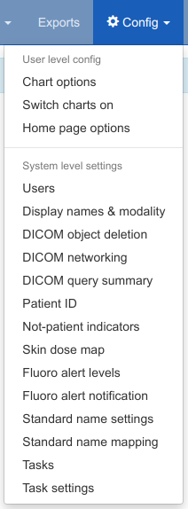
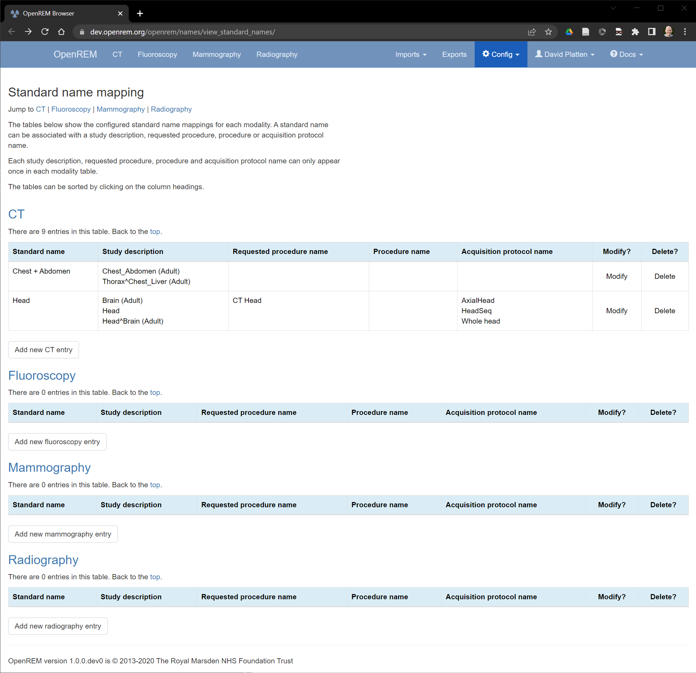
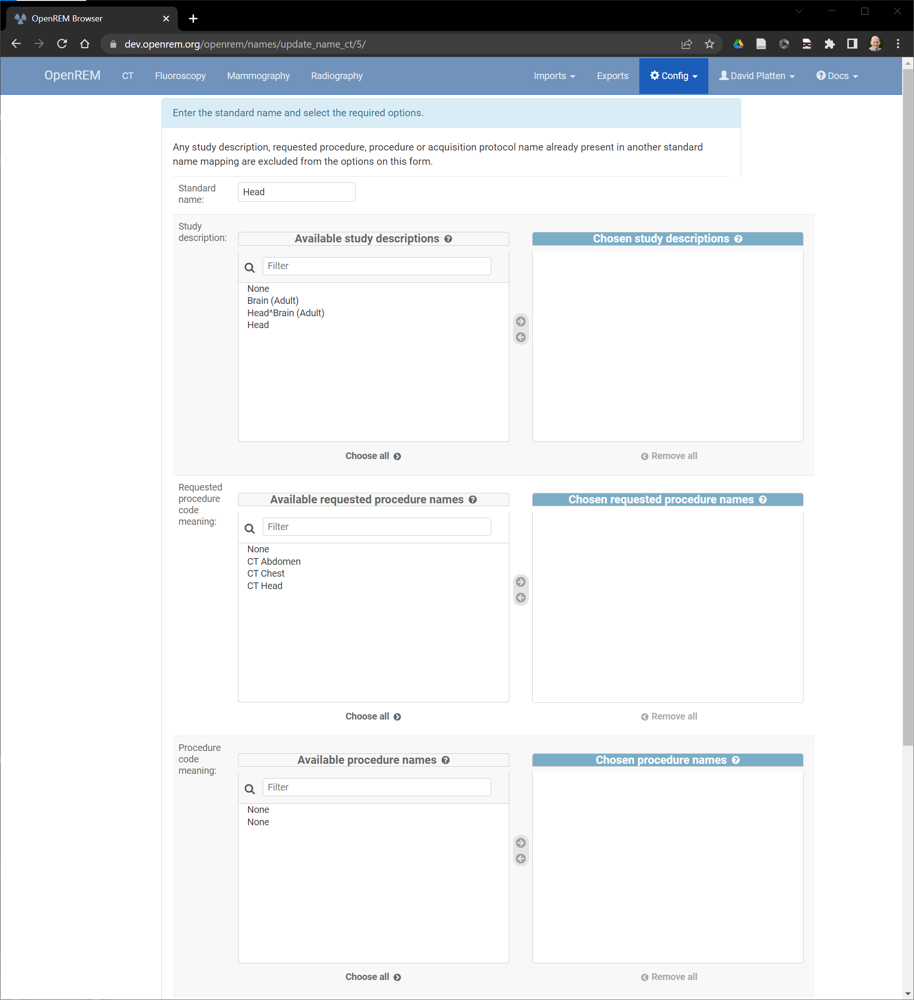
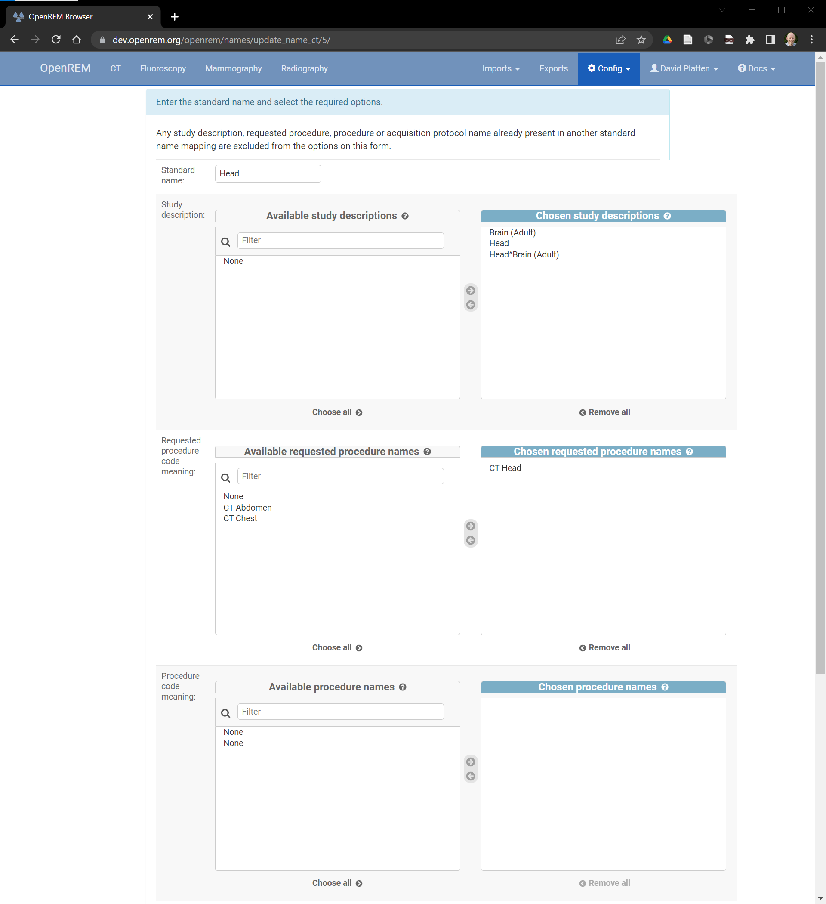
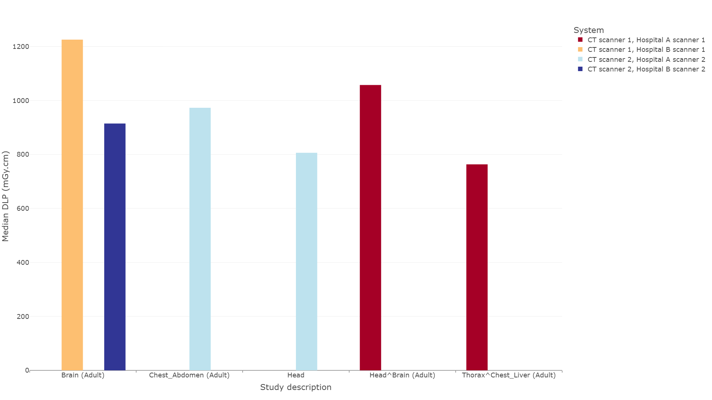
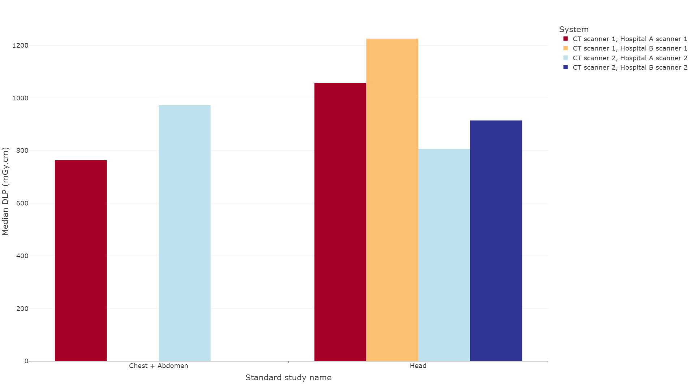

#####################
Standard name mapping
#####################

************
Introduction
************

The same type of examination can appear in OpenREM under a range of different ``requested procedure names``,
``study descriptions`` or ``procedure names``. Individual acquistions of the same type may appear under a range of
different ``acquisition protocol names``. The standard name mapping feature allows a number of differently named exams
or acquisitions to be grouped into a single standard name, allowing easier analysis of data for audits and DRL creation.

Selecting the ``standard name mapping`` option within the ``Config`` drop down menu (figure 1) will take the user to
the standard name mapping summary page.

   Figure 1: The config menu

The standard name mapping summary page (figure 2) shows any existing standard name mappings, which the user is able to
``Modify`` or ``Delete`` using the buttons on the right hand side of each entry.

   Figure 2: The standard name mapping summary page

************************************
Creating a new standard name mapping
************************************

A new standard name mapping can be created by clicking on the ``Add new XX entry`` button, where ``XX`` corresponds to a
particular modality. This takes the user to a screen (figure 3) where the new standard name must be set, and select the
``study descriptions``, ``requested procedure names``, ``procedure names`` and ``acquaition protocol names`` that the
user wants to be included in the new standard name definition. The available items are listed in the left-hand tables.
The user can move a required item into the right-hand table by double-clicking on an entry, or selecting an entry and
then clicking on the arrow pointing to the right.

   Figure 3: Adding or modifying a standard name

The example in figure 4 shows that head-related ``study descriptions`` and ``requested procedure names`` have been
chosen for a new standard name of ``Head``.

Once all relevant options have been transferred to the right-hand box, the ``Submit`` button at the bottom of the page
must be clicked to confirm the new entry. Once a description or name is assigned to a standard name, it cannot be added
to any other standard name and disappears as an option in the left-hand tables to transfer for future new standard name
entries.

   Figure 4: Adding or modifying a standard name mapping

******
Charts
******

Charts of standard name data can be plotted in OpenREM. This can be helpful because at study-level it enables multiple
``study descriptions``, ``requested procedure names`` and ``procedure names`` to be combined into a single data point.
At acquisition level, multiple ``acquisition protocol names`` can be combined into a single data point. For example,
figure 5 below shows the median DLP for a range of ``study descriptions``. Three of the ``study descriptions`` relate
to the head, and two of them relate to scans of the chest and abdomen. The three head-related descriptions have been
mapped to a ``Head`` standard study name, and the two chest and abdomen descriptions have been mapped to a
``Chest + Abdomen`` standard study name, resulting in the chart shown in figure 6. The standard name mapping allows
clearer visual comparison of the data per study for each hospital and piece of equipment.

   Figure 5: Chart of median DLP for each study description

   Figure 6: Chart of median DLP for each standard study name
