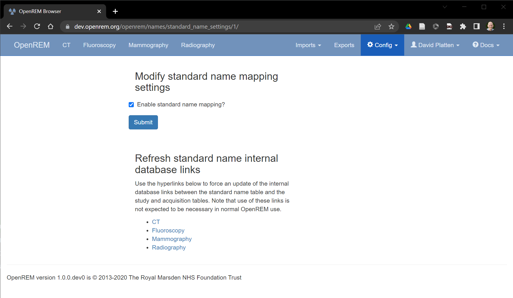
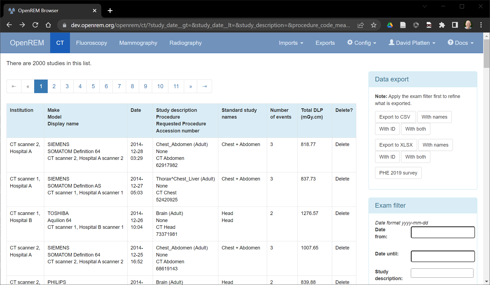
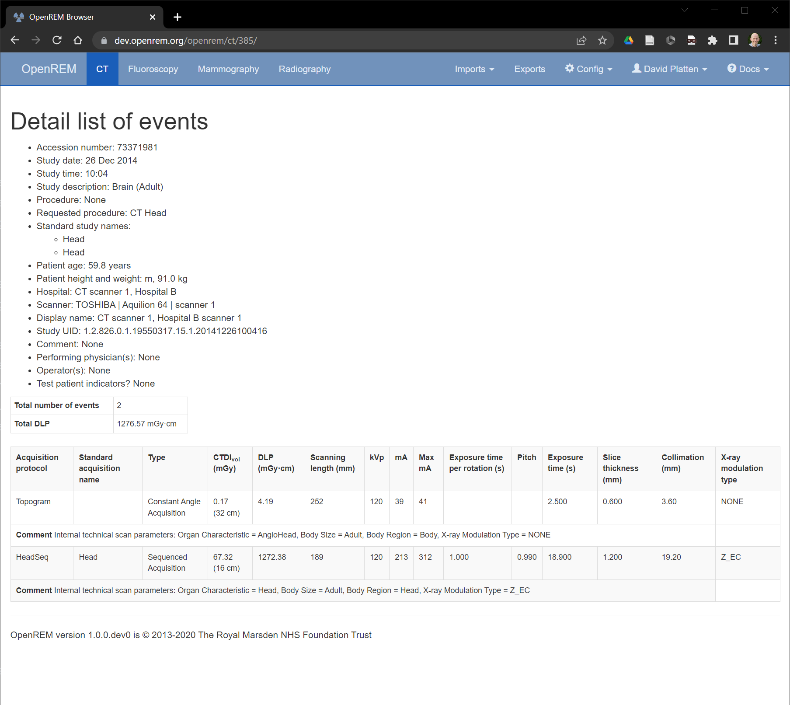

#####################
Standard name mapping
#####################

************
Introduction
************

.. figure:: img/ConfigMenu.png
   :figwidth: 30%
   :align: right
   :alt: The OpenREM config menu
   :target: _images/ConfigMenu.png

   Figure 1: The config menu

The same type of examination can appear in OpenREM under a range of different ``requested procedure names``,
``study descriptions`` or ``procedure names``. Individual acquistions of the same type may appear under a range of
different ``acquisition protocol names``. The standard name mapping feature allows a number of differently named exams
or acquisitions to be grouped into a single standard name, allowing easier analysis of data for audits and diagnostic
reference level (DRL) creation (see DRL definition on the IAEA_ website).

If the logged in user is an OpenREM adminstrator the ``standard name settings`` option will be available on the
``Config`` drop down menu (figure 1). Clicking on this will take the administrator to the standard name mapping settings
page (figure 2). From this page the administrator can enable or disable standard name mapping for the OpenREM
installation. Enabling standard name mapping causes an additional column to be displayed in each modality summary page
where any standard study-level names associated with each entry in the exam table are displayed (figure 3); when viewing
the details of an individual study any matching standard acquisition names are displayed in the appropriate table row
(figure 4). Enabling standard name mapping also makes the standard study name and standard acquisition name charts
available. The administrator can also use the ``standard name settings`` page to access the standard name internal
database refresh links. Note that the use of these links is not expected to be necessary in normal OpenREM use.

   Figure 2: The standard name mapping settings page

   Figure 3: Standard study names visible in the CT summary page

   Figure 4: Standard acquisition names visible in a study details page

Selecting the ``standard name mapping`` option within the ``Config`` drop down menu (figure 1) will take the user to
the standard name mapping summary page(figure 5). This page shows any existing standard name mappings, which an OpenREM
administrator is able to ``Modify`` or ``Delete`` using the buttons on the right hand side of each entry. A normal
OpenREM user can only view standard name mappings.

.. figure:: img/standard_name_mapping_summary.png
   :figwidth: 100%
   :align: center
   :alt: The standard name mapping summary page
   :target: _images/standard_name_mapping_summary.png

   Figure 5: The standard name mapping summary page

************************************
Creating a new standard name mapping
************************************

A new standard name mapping can be created by an OpenREM administrator by clicking on the ``Add new XX entry`` button,
where ``XX`` corresponds to a particular modality. This takes the administrator to a screen where the new standard name
is set (figure 6), and where the administrator selects the ``study descriptions``, ``requested procedure names``,
``procedure names`` and ``acquisition protocol names`` that they want to be included in the new standard name
definition. The available items are listed in the left-hand tables. The administrator can move a required item into the
right-hand table by double-clicking on an entry, or selecting an entry and then clicking on the arrow pointing to the
right.

.. figure:: img/standard_name_mapping_add.png
   :figwidth: 100%
   :align: center
   :alt: Adding or modifying a standard name
   :target: _images/standard_name_mapping_add.png

   Figure 6: Adding or modifying a standard name

The example in figure 7 shows that head-related ``study descriptions`` and ``requested procedure names`` have been
chosen for a new standard name of ``Head``.

Once all relevant items have been transferred to the right-hand tables the ``Submit`` button at the bottom of the page
must be clicked to confirm the new entry. Once a ``study description``, ``requested procedure name``,
``procedure name`` or ``acquisition protocol name`` has been assigned to a standard name it cannot be added to another
standard name, and disappears as an option in the left-hand tables when configuring future new standard name entries.

.. figure:: img/standard_name_mapping_adding.png
   :figwidth: 100%
   :align: center
   :alt: Mapping a new standard name
   :target: _images/standard_name_mapping_adding.png

   Figure 7: Adding or modifying a standard name mapping

******
Charts
******

Charts of standard name data can be plotted in OpenREM. This can be helpful because at study-level it enables multiple
``study descriptions``, ``requested procedure names`` and ``procedure names`` to be combined into a single data point.
At acquisition level, multiple ``acquisition protocol names`` can be combined into a single data point. For example,
figure 8 below shows the median DLP for a range of ``study descriptions``. Three of the ``study descriptions`` relate
to the head, and two of them relate to scans of the chest and abdomen. The three head-related descriptions have been
mapped to a ``Head`` standard study name, and the two chest and abdomen descriptions have been mapped to a
``Chest + Abdomen`` standard study name, resulting in the chart shown in figure 9. The standard name mapping allows
clearer visual comparison of the data per study for each hospital and piece of equipment.

.. figure:: img/ChartCTStudyDescriptionDLPMedian.png
   :figwidth: 100%
   :align: center
   :alt: Chart of median DLP for each study description
   :target: _images/ChartCTStudyDescriptionDLPMedian.png

   Figure 8: Chart of median DLP for each study description

.. figure:: img/ChartCTStudyDescriptionDLPMedianStdName.png
   :figwidth: 100%
   :align: center
   :alt: Chart of median DLP for each standard study name
   :target: _images/ChartCTStudyDescriptionDLPMedianStdName.png

   Figure 9: Chart of median DLP for each standard study name

.. _IAEA: https://www.iaea.org/resources/rpop/health-professionals/radiology/diagnostic-reference-levels
