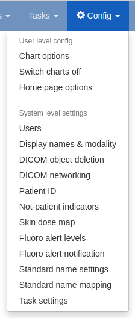

Task management
***************
*New in 0.9*

.. contents::

Viewing task and service statuses
=================================

   Figure 1: The ``Config`` menu (user and admin)

Users who are logged in with admin rights can use the **Config** menu and choose **Tasks** to see the following:

* A list of the tasks currently being executed
* A list of previous tasks and their final status. If any errors occured they will be displayed here.

   Figure 2: The task administration page

Terminating running tasks
=========================

It is possible to terminate any active tasks by clicking the red button. **There is no confirmation step**.
Note that this immediately interrupts everything this process was doing so far, leading to things like partially
imported studies. In general this should not be an issue (in case of aborted imports they
should be completed when you start importing them again), but note that there is a certain risk in killing tasks
and use this only as a last resort.

A note on move: executing a move will create a task which then produces import tasks for all the studies it should
import. This means if you intend to abort a move you should abort the task with Task type "move" and not the import
tasks started by that process!