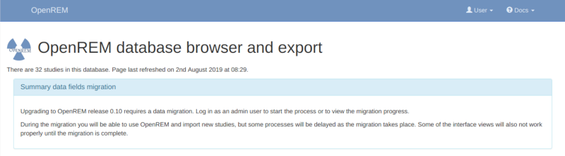
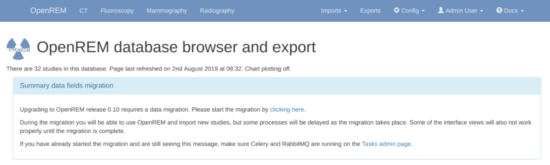
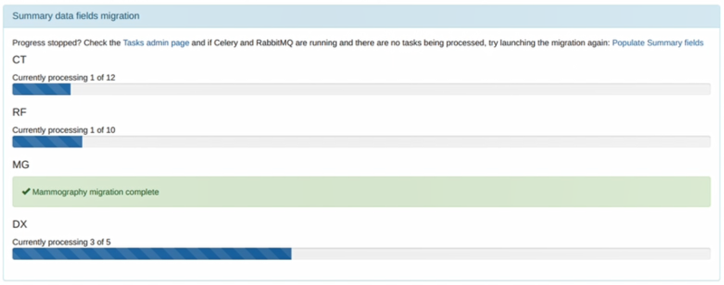

#############################################
Upgrade to OpenREM 0.10.0 from 0.7.3 or later
#############################################

*doc not ready for translation*
**needs review**

Upgrades to OpenREM 1.0 can only be made from version 0.10.0. Installations earlier than that need to be updated
to version 0.10.0 before updating to version 1.0.

These instructions can be used to upgrade any database from version 0.7.3 or later. 0.7.3 was released in August 2016.
For upgrades from versions earlier than that, please review the upgrade instructions for that version in the
`0.10.0-docs <https://docs.openrem.org/en/0.10.0-docs/release-0.7.3.html>`_.

*******************
Upgrade preparation
*******************

Python 2.7.9 or later must be installed, but it must still be Python 2.7 and not any of the Python 3 releases.

To check the Python version, activate the virtualenv if you are using one, then:

.. code-block:: console

    $ python -V

If the version is earlier than ``2.7.9``, then an upgrade is needed. If the version is ``3.x``, then Python 2.7 must
be installed.

**Ubuntu Linux**

* Check which version of Ubuntu is installed (``lsb_release -a``)
* If it is 14.04 LTS (Trusty), then an operating system upgrade or migration to a new server is required. If migrating,
  ensure the version of OpenREM installed on the new server is the same as the one on the old server, then
  :ref:`restore-psql-linux` following the instructions and when up and running again perform the upgrade on the new
  server
* 16.04 LTS (Xenial) or later should have 2.7.11 or later available.
* For other Linux distributions check in their archives for which versions are available.

**Windows**

* A newer version of Python 2.7 can be downloaded from `python.org <https://www.python.org/downloads>`_ and installed
  over the current version.

**Linux and Windows**

* With a version of Python 2.7.9 or later, setuptools can be updated (activate virtualenv if using one):

    .. code-block:: console

        $ pip install setuptools -U

*******
Upgrade
*******

* Back up your database

    * For PostgreSQL on linux you can refer to :ref:`backup-psql-db`
    * For PostgreSQL on Windows you can refer to :ref:`database-windows`
    * For a non-production SQLite3 database, simply make a copy of the database file

* Stop any Celery workers

* Consider temporarily disabling your DICOM Store SCP, or redirecting the data to be processed later

* If you are using a virtualenv, activate it

* Install specific versions of some packages that are needed:

.. code-block:: console

    $ pip install django-crispy-forms==1.8.1
    $ pip install django-solo==1.1.5
    $ pip install flower==0.9.5

* Install specific version of Celery:

    **Linux server:**

    .. code-block:: console

        $ pip install celery==4.2.2

    **Windows server:**

    .. code-block:: console

        D:\>pip install celery==3.1.25

* Install the new version of OpenREM:

    .. code-block:: console

        $ pip install openrem==0.10.0

Update the configuration
========================

Locate and edit your local_settings file

* Ubuntu linux: ``/usr/local/lib/python2.7/dist-packages/openrem/openremproject/local_settings.py``
* Other linux: ``/usr/lib/python2.7/site-packages/openrem/openremproject/local_settings.py``
* Linux virtualenv: ``vitualenvfolder/lib/python2.7/site-packages/openrem/openremproject/local_settings.py``
* Windows: ``C:\Python27\Lib\site-packages\openrem\openremproject\local_settings.py``
* Windows virtualenv: ``virtualenvfolder\Lib\site-packages\openrem\openremproject\local_settings.py``

Add additional log file configuration - changed with 0.8
^^^^^^^^^^^^^^^^^^^^^^^^^^^^^^^^^^^^^^^^^^^^^^^^^^^^^^^^

Add the new extractor log file configuration to the ``local_settings.py`` - you can copy the 'Logging
configuration' section here if you haven't made any changes. The addition that needs to be inserted are the
lines relating to the ``extractor`` log file. This is only for upgrading the database - the ``local_settings.py``
file will be updated again for the upgrade to 1.0:

.. code-block:: python

    # Logging configuration
    # Set the log file location. The example places the log file in the media directory. Change as required - on linux
    # systems you might put these in a subdirectory of /var/log/. If you want all the logs in one file, set the filename
    # to be the same for each one.
    import os
    LOG_ROOT = MEDIA_ROOT
    logfilename = os.path.join(LOG_ROOT, "openrem.log")
    qrfilename = os.path.join(LOG_ROOT, "openrem_qr.log")
    storefilename = os.path.join(LOG_ROOT, "openrem_store.log")
    extractorfilename = os.path.join(LOG_ROOT, "openrem_extractor.log")

    LOGGING['handlers']['file']['filename'] = logfilename          # General logs
    LOGGING['handlers']['qr_file']['filename'] = qrfilename        # Query Retrieve SCU logs
    LOGGING['handlers']['store_file']['filename'] = storefilename  # Store SCP logs
    LOGGING['handlers']['extractor_file']['filename'] = extractorfilename  # Extractor logs

    # Set log message format. Options are 'verbose' or 'simple'. Recommend leaving as 'verbose'.
    LOGGING['handlers']['file']['formatter'] = 'verbose'        # General logs
    LOGGING['handlers']['qr_file']['formatter'] = 'verbose'     # Query Retrieve SCU logs
    LOGGING['handlers']['store_file']['formatter'] = 'verbose'  # Store SCP logs
    LOGGING['handlers']['extractor_file']['formatter'] = 'verbose'  # Extractor logs

    # Set the log level. Options are 'DEBUG', 'INFO', 'WARNING', 'ERROR', and 'CRITICAL', with progressively less logging.
    LOGGING['loggers']['remapp']['level'] = 'INFO'                    # General logs
    LOGGING['loggers']['remapp.netdicom.qrscu']['level'] = 'INFO'     # Query Retrieve SCU logs
    LOGGING['loggers']['remapp.netdicom.storescp']['level'] = 'INFO'  # Store SCP logs
    LOGGING['loggers']['remapp.extractors.ct_toshiba']['level'] = 'INFO'  # Toshiba RDSR creation extractor logs

Migrate the database
====================

In a shell/command window, move into the ``openrem`` folder:

* Ubuntu linux: ``/usr/local/lib/python2.7/dist-packages/openrem/``
* Other linux: ``/usr/lib/python2.7/site-packages/openrem/``
* Linux virtualenv: ``vitualenvfolder/lib/python2.7/site-packages/openrem/``
* Windows: ``C:\Python27\Lib\site-packages\openrem\``
* Windows virtualenv: ``virtualenvfolder\Lib\site-packages\openrem\``

.. code-block:: console

    python manage.py makemigrations remapp
    python manage.py migrate remapp

.. _service_name_change:

Systemd service names in Ubuntu installs
========================================

Systemd service files were renamed in the the 0.9.1 docs to use *openrem-function* rather than *function-openrem*. To
update the service files accordingly, follow the following steps. **This is optional**, but will make finding them
easier (e.g. ``sudo systemctl status openrem-[tab][tab]`` will list them) and these names are assumed for the
:doc:`upgrade_docker` and :doc:`upgrade_linux` docs. However, only the ``gunicorn`` service remains after the upgrade to
1.0, so you may find it easier just to remember the only service names, or just rename that one.

.. code-block:: console

    sudo systemctl stop gunicorn-openrem.service
    sudo systemctl stop celery-openrem.service
    sudo systemctl stop flower-openrem.service

    sudo systemctl disable gunicorn-openrem.service
    sudo systemctl disable celery-openrem.service
    sudo systemctl disable flower-openrem.service

    sudo mv /etc/systemd/system/{gunicorn-openrem,openrem-gunicorn}.service
    sudo mv /etc/systemd/system/{celery-openrem,openrem-celery}.service
    sudo mv /etc/systemd/system/{flower-openrem,openrem-flower}.service

    sudo systemctl enable openrem-gunicorn.service
    sudo systemctl enable openrem-celery.service
    sudo systemctl enable openrem-flower.service

    sudo systemctl start openrem-gunicorn.service
    sudo systemctl start openrem-celery.service
    sudo systemctl start openrem-flower.service

Upgrade to 1.0
==============

Now return to :doc:`installation` instructions to follow the instructions to 1.0 for your preferred server solution.

After upgrading to version 1.0, there will be automatic tasks that are created to populate the summary fields introduced
in version 0.10.

Log in as an administrator to start the migration process. If you have
a large number of studies in your database this can take some time. A large database (several hundred studies) on slow
disks might take a day or two, on faster disks or with a smaller database it could take from a few minutes to an hour
or so. You will be able to monitor the progress on the home page as seen in the figure at the bottom of this page.

One task per modality type (CT, fluoroscopy, mammography and radiography) is generated to create a task per study in
each modality to populate the new fields for that study. If the number of workers is the same or less than the number
of modality types in your database then the study level tasks will all be created before any of them are executed as
all the workers will be busy. Therefore there might be a delay before the progress indicators on the OpenREM front
page start to update. You can review the number of tasks being created on the ``Config -> Tasks`` page.

Before the migration is complete, some of the information on the modality pages of OpenREM will be missing, such as the
dose information for example, but otherwise everything that doesn't rely on Celery workers will work as normal. Studies
sent directly to be imported will carry on during the migration, but query-retrieve tasks will get stuck behind the
migration tasks.

When the process is complete the 'Summary data fields migration' panel will disappear and will not be seen again.
